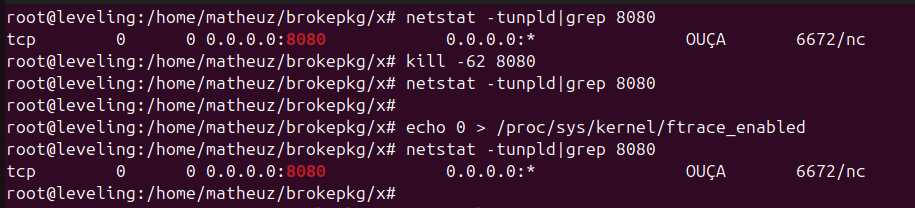
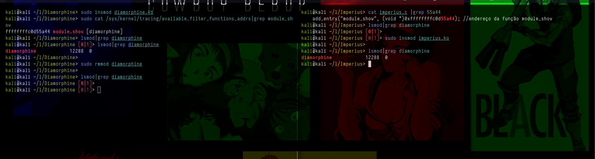
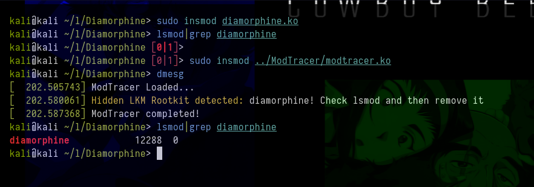

#  Cheat sheet for detect and remove linux kernel rootkits

>  Created by @MatheuzSecurity
- https://br.linkedin.com/in/matheus-alves-212775208
- More rootkit / malware content in rootkit researchers group
>  Join: https://discord.gg/66N5ZQppU7

Nowadays, rootkits are becoming increasingly sophisticated and stealthy, so detecting them and especially removing them is an extremely difficult task.

In this cheat sheet I include several techniques to help with this

## Detect Linux Kernel Rootkits

### Finding rootkits in sysfs/tracing

- `/sys/kernel/tracing/available_filter_functions` # Lists kernel functions that can be filtered for tracing.
- `/sys/debug/kernel/tracing/available_filter_functions` # Alternative for listing filterable functions, in debug mode.
- `/sys/kernel/tracing/available_filter_functions_addrs` # Lists filterable functions with addresses, only in kernel 6.5+
- `/sys/debug/kernel/tracing/available_filter_functions_addrs` # Like the previous one, but in debug mode, kernel 6.5+
- `/sys/kernel/tracing/enabled_functions` # Lists kernel functions currently enabled for tracing
- `/sys/debug/kernel/tracing/enabled_functions` # alternative list of tracked functions, in debug mode
- `/sys/kernel/debug/tracing/trace` # Where tracking events are recorded in real time
- `/sys/kernel/tracing/trace` # Like the previous one, it allows you to view the trace, does not require debug mode
- `/sys/kernel/debug/dynamic_debug/control` # enable/disable real-time kernel debug messages for specific modules
- `/sys/kernel/tracing/touched_functions` # shows all functions that was every traced by ftrace or a direct trampoline (only for kernel 6.4+)
- `/sys/fs/bpf/*` # Directory for BPF (eBPF) maps and programs, used for tracking and security
- `/sys/module/*` # Contains information about loaded kernel modules, such as parameters and states
- `/sys/kernel/tracing/kprobe_events` # Contains kprobes events


### Finding rootkits in procfs

- `/proc/kallsyms` # Lists all kernel symbols, including function and variable addresses
- `/proc/modules` # Displays modules loaded in the kernel, with information such as size, usage, etc.
- `/proc/vmallocinfo` # Shows memory usage allocated by vmalloc
- `/proc/sys/kernel/tainted` # Indicates the "contamination" state of the kernel, signaling modifications or errors.

### Logs

- `/var/log/dmesg*` # Kernel messages logs, captured by the dmesg command
- `/var/log/kern.log` # Stores logs of kernel events and messages, useful for monitoring and debugging
- `/dev/kmsg` # Interface for sending and reading kernel messages in real time
- `dmesg` # Command to view kernel logs messages and boot
- `journalctl -k` # Shows kernel logs captured by systemd-journald

### Tools open source

- [Nitara2](https://github.com/ksen-lin/nitara2)
- [Tracee](https://github.com/aquasecurity/tracee)
- [bpf-hookdetect](https://github.com/pathtofile/bpf-hookdetect)

## Making ftrace based rootkit useless

Most rootkits that still work for the most recent kernel use the famous ftrace hooking based method, as hijacking the syscall table has become old and non-functional for most of the most recent kernels, precisely because of protections. and changes that the kernel underwent.

So since most current rootkits use ftrace, why not disable it?

<p align="center"></p>

You can do this to search for PIDs, hidden directories for example. By disabling ftrace you basically make any ftrace hook useless, but if you enable it again, the hooks will work again. (remembering that there are ways to protect your rootkit that uses ftrace from being bypassed in this way).

```
echo 0 > /proc/sys/kernel/ftrace_enabled
or
sysctl kernel.ftrace_enabled=0
```

## Removing LKM Rootkits 

### [Imperius](https://github.com/MatheuZSecurity/Imperius)

You can use a combination of tracing to obtain the address of a function, for example `module_show` from diamorphine, with imperius, basically imperius will call this function, adding it back to lsmod, and making the LKM rootkit visible.

<p align="center"></p>

### [ModTracer](https://github.com/MatheuZSecurity/ModTracer)

ModTracer aims to find LKM rootkits that are hidden inside the system and make them visible again.

<p align="center"></p>

# Contribution

If you want to contribute to this repository with more tricks to detect or remove Linux Kernel Rootkit, please contact me.

NOTE: More things coming soon
